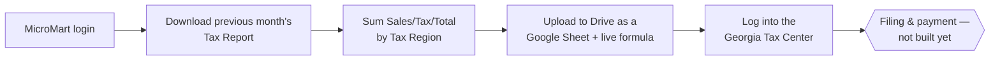

# Monthly Sales & Use Tax Agent

An automation that pulls a smart-vending operator's monthly tax report out of their
point-of-sale platform, totals it by tax jurisdiction, drops a live spreadsheet in Google
Drive, and logs into the state tax portal — laying the groundwork to file and pay sales & use
tax each month without anyone digging through a dashboard by hand.

Built for [Access Amenities](https://www.accessamenities.com), a smart-vending operator, to
replace a manual monthly chore: someone had to log into MicroMart (the point-of-sale platform
for the vending machines), pull the Tax Report for the month that just ended, add up what's
owed, and get that number into the Georgia Tax Center to file and pay. That last part —
filing and paying — is still ahead; what's built so far gets all the way up to it.

This repo lives locally alongside a sibling project under a local `access-amenities-tools/`
folder (not itself a GitHub repo — each tool gets its own; this one is
[MM-Sales-Use-Tax-Agent](https://github.com/PSlappy/MM-Sales-Use-Tax-Agent)). The sibling,
[MM-VS-Sales-Reconciliation-Agent](https://github.com/PSlappy/MM-VS-Sales-Reconciliation-Agent),
runs daily and reconciles sales data into a different system — this one runs monthly and is
about tax, not day-to-day bookkeeping, but they share the same MicroMart login since it's the
same account.

## What it actually does, so far



Everything through logging into the Georgia Tax Center works end to end. What happens after
that — actually filing the return and paying — hasn't been built, because it hasn't been
decided yet exactly what that should look like (fully automated? a human confirms the final
submit? both?). That's the next real conversation, not something to guess at.

## Why this shape, not a simpler one

- **A live spreadsheet, not a static export.** The Drive upload isn't just the raw CSV — it's
  converted into a Google Sheet with a second tab that runs a single formula
  (`QUERY(...) group by Tax Region`) against the raw data. Open it in Drive and the per-region
  totals are already there and already correct, no separate file to cross-check, and it
  recalculates itself if the raw data tab is ever hand-edited. It also means the formula
  doesn't need touching as more tax regions get added later — it already handles however many
  rows and regions the source data contains.
- **A government login is treated with more caution than a vendor dashboard.** The Georgia Tax
  Center login step refuses outright if it ever detects a CAPTCHA on the page, rather than
  attempt to solve or work around it. Some things shouldn't be automated past.
- **The tax-report page turned out to be flaky, so the code assumes that.** MicroMart's
  analytics query for the Tax Report sometimes just... doesn't finish, or the chart on the page
  outright errors with "There was a problem displaying this chart." First discovered by running
  it for real, not by reading documentation. The download step now clears every filter before
  re-applying the date range and retries with a full page reload (up to three attempts) if
  either failure shows up, rather than trusting the first attempt.
- **A brand-new login gets treated differently than a returning one, and that surprised me.**
  The Georgia Tax Center challenged this tool's dedicated browser profile with an emailed
  security code on its very first login — even though the same account shows no such challenge
  in a normal, already-trusted browser. First version of the login-success check didn't know
  that screen existed and reported success anyway, which was wrong. Fixed twice: first to
  recognize the screen and fail loudly instead of a false positive, then to actually get past it
  — the code reads the security code straight out of the Gmail inbox it just got emailed to
  (read-only access, and it only ever looks for that one specific email) and checks "Trust this
  device" itself, so a brand-new machine doesn't need a human at all, not even once. A manual
  fallback (`src/manual_gtc_login.py`) still exists in case the automated email lookup ever
  times out.
- **Deterministic pipeline, not an AI agent driving the browser live.** The actual clicking,
  filling, and file handling is a plain [Playwright](https://playwright.dev/python/) script,
  same as the sibling tool — repeatable, fast, and auditable. An AI agent was used to build and
  debug it (including live-inspecting the real MicroMart dashboard's DOM to find the correct
  selectors rather than guessing from a screenshot), but the thing that would eventually run on
  a schedule is ordinary code, not a live agent loop.
- **Resumable by step, not all-or-nothing.** `--resume-from <step>` restarts partway through —
  useful given how many of the steps above turned out to need a second pass to get right.
- **Credentials never touch the codebase.** MicroMart and Georgia Tax Center passwords live in
  the local macOS Keychain; Google access is a scoped OAuth refresh token, also in Keychain.
  Nothing ever lands in a shell history, a chat log, or a commit.

## Stack

- **Python + [Playwright](https://playwright.dev/python/)** — browser automation
- **[pyotp](https://github.com/pyauth/pyotp)** — TOTP code generation for MicroMart's MFA
  (shared login logic with the sibling tool)
- **Google Drive API + Google Sheets API** (OAuth, scoped to `drive.file` + `spreadsheets`) —
  uploading the monthly report as a formula-driven spreadsheet
- **Gmail API** (OAuth, read-only) — reading the Georgia Tax Center's device-verification
  security code so a brand-new machine doesn't need a human to complete that step by hand
- **macOS Keychain** — credential storage

## How it runs, today

Manually, one step at a time while it's still being built out:

```bash
.venv/bin/python src/sync.py                          # full pipeline from the top
.venv/bin/python src/sync.py --resume-from gtc_login   # just one step
```

No scheduling is set up yet — that's premature until filing/payment exists and the whole
pipeline is something worth running unattended. See the sibling tool's `launchd` setup for the
pattern this will likely follow once it's ready.

## One-time setup

1. `python3 -m venv .venv && .venv/bin/pip install -r requirements.txt && .venv/bin/playwright install chromium`
2. Store MicroMart and Georgia Tax Center credentials in Keychain — see
   [`config/keychain-setup.md`](config/keychain-setup.md).
3. Set up Google OAuth (Drive + Sheets + read-only Gmail) — see
   [`docs/google-oauth-setup.md`](docs/google-oauth-setup.md), then run
   `.venv/bin/python src/authorize_drive.py` once for the interactive consent.
4. Create `config/drive-folder-id.txt` (the target Drive folder's ID) — see the adjacent
   `.example.txt` file. Gitignored since it's environment-specific, not code.

A first-ever Georgia Tax Center login on a new machine should complete on its own (the security
code gets read straight from Gmail) — `src/manual_gtc_login.py` is only needed as a fallback if
that ever times out.

## Files

- `src/sync.py` — the pipeline: MicroMart login, tax report download, per-region summary,
  Drive upload, Georgia Tax Center login
- `src/authorize_drive.py` — one-time Google OAuth consent flow
- `src/manual_gtc_login.py` — one-time manual step for a new machine/browser profile to become
  trusted by the Georgia Tax Center (see `CLAUDE.md` for why this exists)
- `src/totp_code.py` — prints a fresh MicroMart MFA code on demand, for manual use

## Status

Login → download → summarize → upload to Drive → log into GTC all work, confirmed against the
real accounts, not just in theory. Filing and paying the actual tax bill is next, and hasn't
been designed yet — that's a real decision about how much of it should be automated versus
left for a human to confirm, not something to build ahead of that conversation.
